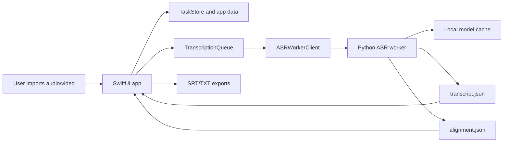
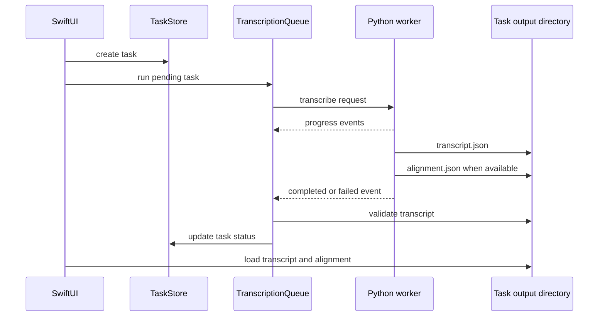

# Architecture

Aural is a local-first macOS transcription app. The public 0.1.0 design keeps user media, transcripts, model resources, and task state on the user's Mac. The app does not upload media for transcription and does not include telemetry or account login.

## Goals

- Provide a simple import, local transcription, playback review, and export workflow.
- Keep model and runtime complexity out of the main user interface.
- Reuse downloaded model resources across app upgrades.
- Keep the Swift app and ASR implementation separated by a small worker protocol.
- Make release packages small enough for normal GitHub Release distribution.

## Non-Goals for 0.1.0

- Real-time microphone transcription.
- Speaker diarization.
- Cloud transcription.
- Built-in summarization or meeting assistant features.
- Intel Mac or CPU-only fallback support.
- Bundled video OCR context enhancement.

## Component Overview



## App Layer

The Swift app owns:

- Importing audio files into app-owned task storage.
- Extracting audio from supported video files through AVFoundation.
- Task records, queue state, search, rename, delete, pause, restart, and export behavior.
- Playback and transcript review UI.
- First-run resource preparation gates.

Task status values are intentionally small:

- `pending`
- `running`
- `paused`
- `done`
- `failed`

The queue processes one task at a time. Progress updates are best effort; final state comes from the worker terminal event and transcript validation.

## Worker Boundary

The Swift app launches a Python worker process and sends one JSON request over stdin. The worker writes JSON event lines over stdout. Technical logs go to stderr and may be persisted as `error.log`.

The production default is `worker_qwen_segmented_bundle.py`. It:

- Normalizes audio through macOS `afconvert`.
- Segments audio locally with `soundfile` and `numpy`.
- Runs Qwen3-ASR on each segment.
- Applies conservative ITN when bundled FST rules are available.
- Refines paragraph timestamps with Qwen3-ForcedAligner when alignment is enabled and available.
- Writes `transcript.json` and, when alignment succeeds, `alignment.json`.

See [Worker Protocol](worker-protocol.md) for the wire contract.

## Runtime and Model Resources

The lightweight release package includes:

- The macOS app.
- A bundled Python runtime.
- Worker scripts.
- ITN resources when supplied at build time.

It does not include ASR or aligner model weights by default.

On first launch, Aural checks the model cache:

```text
~/Library/Application Support/Aural/Models
```

Expected model directories:

```text
qwen3-asr-0.6b-4bit
qwen3-asr-1.7b-4bit
qwen3-asr-1.7b-bf16
qwen3-forcedaligner-0.6b-4bit-mlx
```

The downloader tries ModelScope first and Hugging Face as a fallback. Completed model directories receive `.aural-complete.json` so later app launches and upgrades can reuse the cache.

## Storage Layout

Default app data root:

```text
~/Library/Application Support/Aural
```

Important child paths:

```text
Models/              Downloaded ASR and aligner model caches
model-profile.json   Selected model profile and alignment preference
tasks/               App-owned task records and generated task artifacts
```

Imported audio is copied into task storage. Imported video is converted to an app-owned audio copy; the original video is not retained inside Aural.

Deleting a task removes the app-owned task directory, local audio copy, transcript JSON, alignment JSON, sidecar files, and task record. It does not delete the user's original source file.

## Transcript Data Flow



The UI reads paragraph-level segments from `transcript.json`. Playback highlighting can use `alignment.json` token-level timings when available and falls back to paragraph timing when it is missing or rejected.

See [Transcript Schema](transcript-schema.md) for persisted data formats.

## Release Compatibility

0.1.0 targets Apple Silicon Macs on macOS 14 or later. A separate discrete GPU is not required; the default runtime relies on Apple Silicon and Metal. Intel Mac and CPU-only backends are tracked as future work, not part of the first public release.

Release builds must audit bundled Python wheels, Mach-O binaries, and Metal libraries so their minimum macOS version does not exceed the release target. See [Local App Packaging](packaging.md) and [Release Notes and Installation](release.md).
